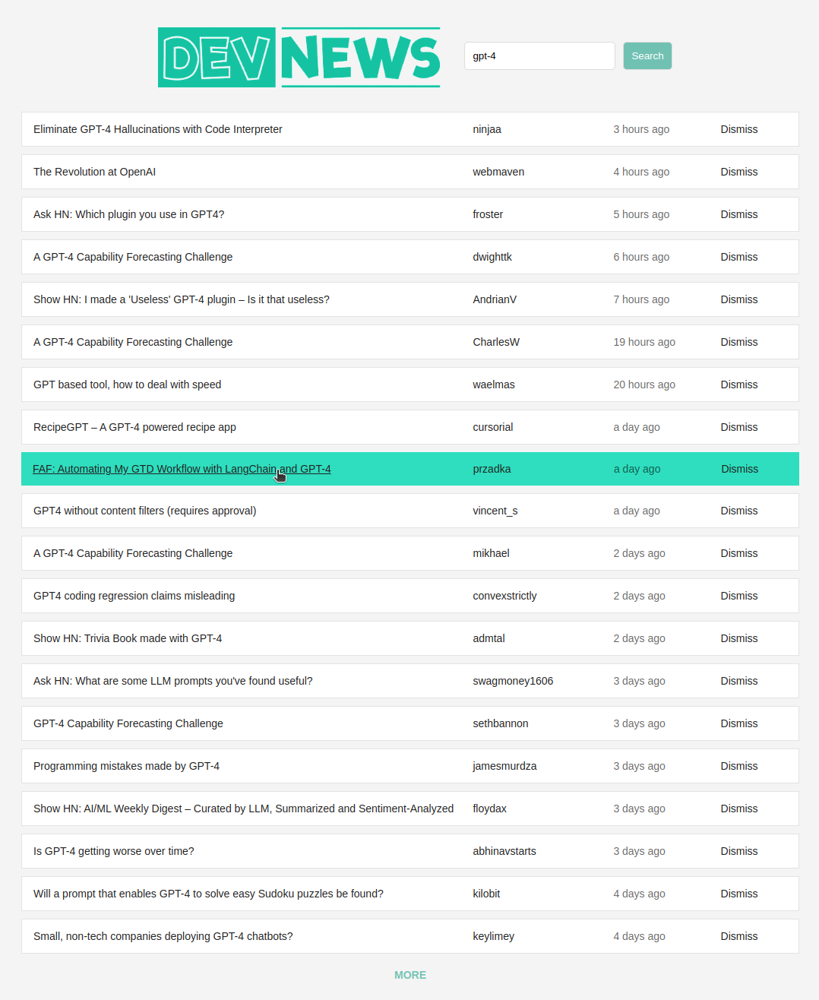

# DEV NEWS

## Introduction

Welcome to **DEV NEWS**! This project aims to provide an intuitive search platform for the developer community, making it easier for developers to find the latest and most relevant news, articles, and updates from various sources in the tech industry.

As developers, staying up-to-date with the latest trends, tools, and news is essential. However, with an overwhelming amount of information available on the internet, it can be challenging to filter and find exactly what you need. **DEV NEWS** solves this problem by offering a user-friendly search interface that allows developers to quickly access the content they are interested in.

## Usage

Execute `yarn start` in your terminal to launch the app and open [http://localhost:3000](http://localhost:3000) to view it in the browser.

## License
**DEV NEWS** is licensed under the **GNU General Public License (GPL)**, which means you are free to use, modify, and distribute the project under the same terms. The GPL promotes the idea of keeping software free and open-source, ensuring that any derived works also remain open.

